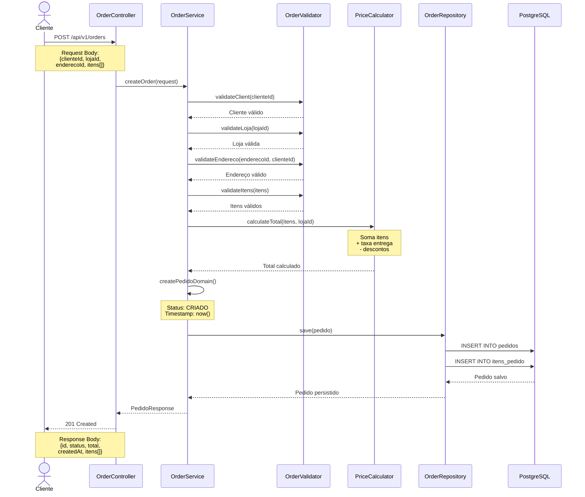
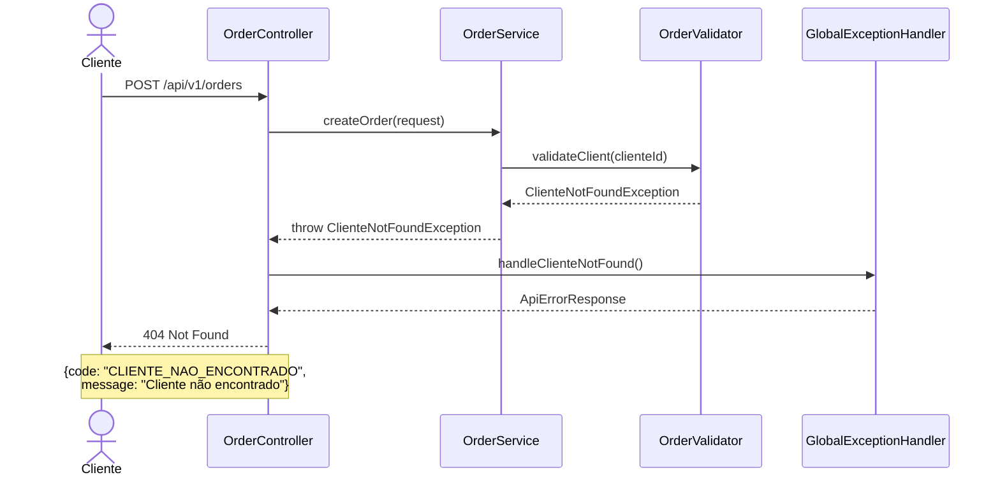
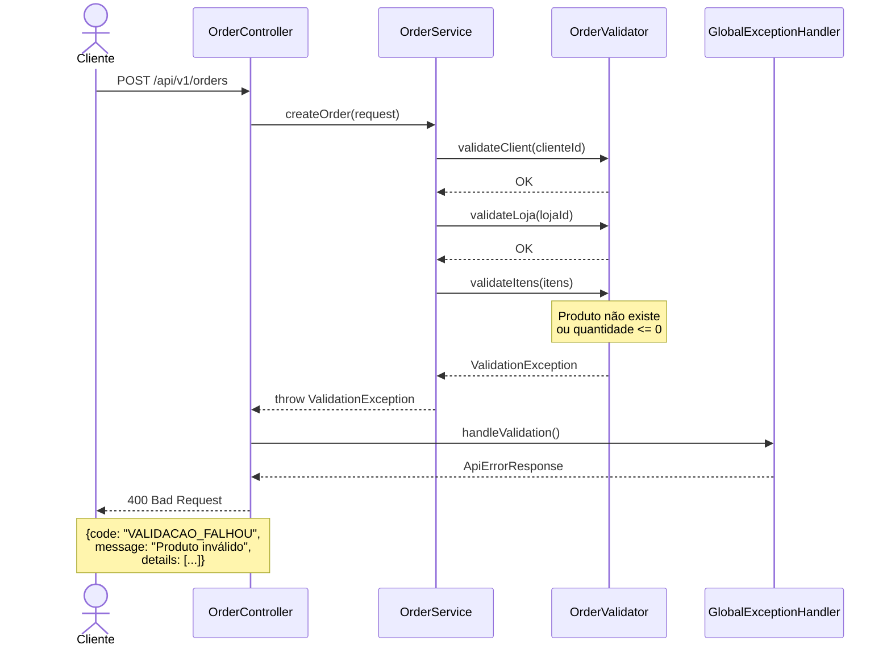
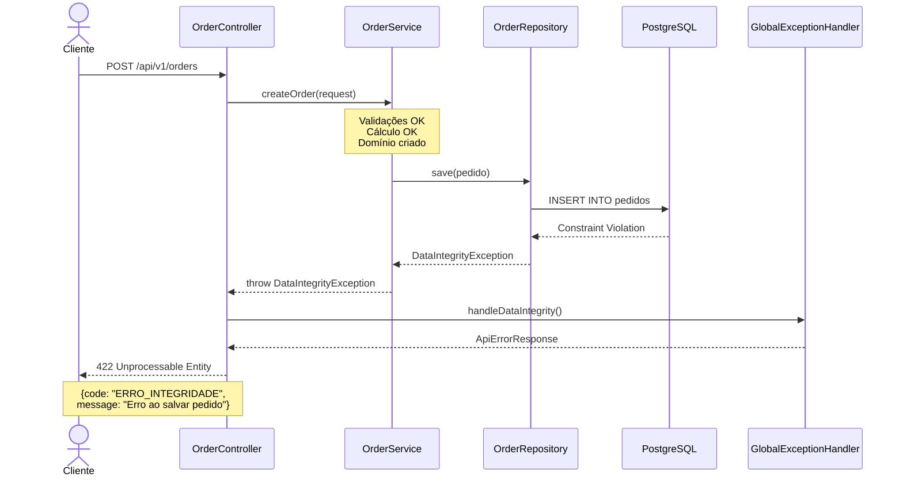

# HIST-001 - Diagrama de Sequência: Criação de Pedido

## Fluxo Principal - Criação de Pedido com Sucesso

## Fluxo Alternativo 1 - Cliente Inválido

## Fluxo Alternativo 2 - Validação de Itens Falha

## Fluxo Alternativo 3 - Erro de Persistência

## Componentes Envolvidos

### Controller Layer
- **OrderController**: Recebe requisição HTTP, delega para service, retorna response

### Service Layer
- **OrderService**: Orquestra validações, cálculos e persistência
- **OrderValidator**: Valida cliente, loja, endereço e itens
- **PriceCalculator**: Calcula total do pedido

### Repository Layer
- **OrderRepository**: Interface JPA para persistência de pedidos

### Exception Handling
- **GlobalExceptionHandler**: Mapeia exceções para respostas HTTP padronizadas

## Códigos de Erro

| Código | HTTP Status | Descrição |
|--------|-------------|-----------|
| CLIENTE_NAO_ENCONTRADO | 404 | Cliente não existe |
| LOJA_NAO_ENCONTRADA | 404 | Loja não existe |
| ENDERECO_NAO_ENCONTRADO | 404 | Endereço não existe |
| PRODUTO_NAO_ENCONTRADO | 404 | Produto não existe |
| VALIDACAO_FALHOU | 400 | Dados de entrada inválidos |
| ERRO_INTEGRIDADE | 422 | Violação de integridade referencial |
| INTERNAL_ERROR | 500 | Erro interno do servidor |

## Tempos Esperados

- **Validações**: < 100ms
- **Cálculo de total**: < 50ms
- **Persistência**: < 200ms
- **Total (happy path)**: < 500ms
