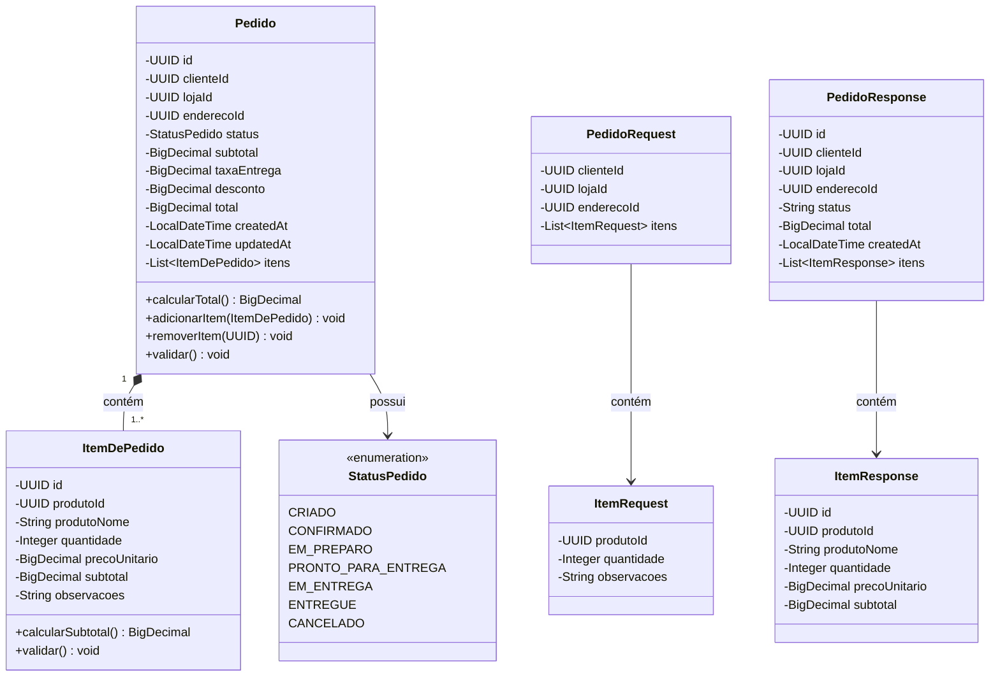
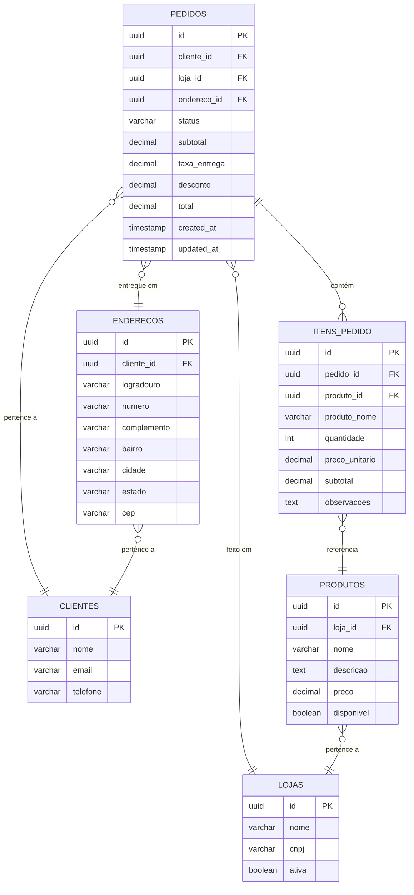
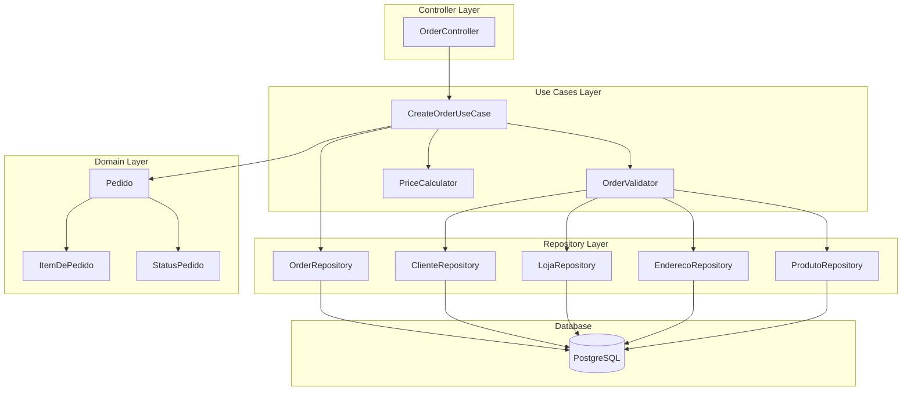
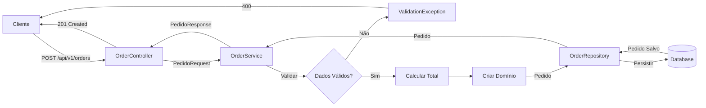
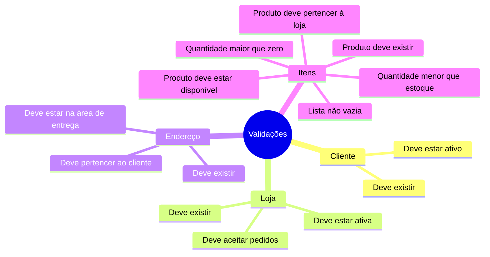
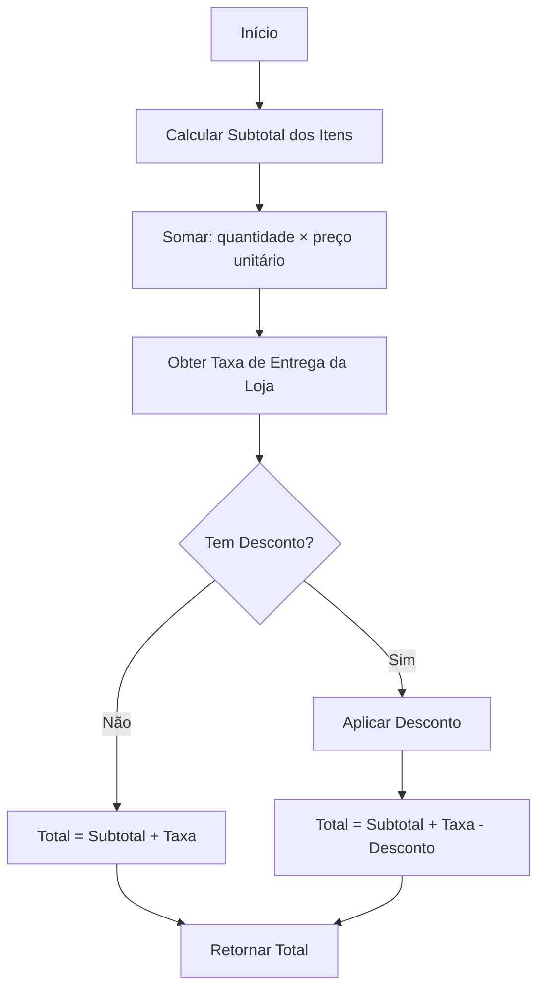

# HIST-001 - Modelagem: Criação de Pedido

## Modelo de Domínio



## Modelo de Persistência (JPA)



## Arquitetura de Camadas



## Fluxo de Dados



## Regras de Negócio

### Validações



### Cálculo de Total



## Estrutura de Pacotes

```
com.poc.delivery
├── domain
│   ├── model
│   │   ├── Pedido.java
│   │   ├── ItemDePedido.java
│   │   └── StatusPedido.java
│   ├── usecase
│   │   ├── CreateOrderUseCase.java
│   │   ├── OrderValidator.java
│   │   └── PriceCalculator.java
│   └── exception
│       ├── ClienteNotFoundException.java
│       ├── LojaNotFoundException.java
│       ├── EnderecoNotFoundException.java
│       ├── ProdutoNotFoundException.java
│       └── ValidationException.java
├── infrastructure
│   ├── persistence
│   │   ├── entity
│   │   │   ├── PedidoEntity.java
│   │   │   ├── ItemPedidoEntity.java
│   │   │   ├── ClienteEntity.java
│   │   │   ├── LojaEntity.java
│   │   │   ├── EnderecoEntity.java
│   │   │   └── ProdutoEntity.java
│   │   └── repository
│   │       ├── OrderRepository.java
│   │       ├── ClienteRepository.java
│   │       ├── LojaRepository.java
│   │       ├── EnderecoRepository.java
│   │       └── ProdutoRepository.java
│   └── mapper
│       ├── PedidoMapper.java
│       └── ItemPedidoMapper.java
└── api
    ├── controller
    │   └── OrderController.java
    ├── dto
    │   ├── request
    │   │   ├── PedidoRequest.java
    │   │   └── ItemRequest.java
    │   └── response
    │       ├── PedidoResponse.java
    │       └── ItemResponse.java
    └── exception
        └── GlobalExceptionHandler.java (já existe)
```

## Decisões Técnicas

### 1. Separação de Domínio e Persistência
- **Decisão**: Usar classes de domínio separadas das entidades JPA
- **Motivo**: Desacoplar regras de negócio da infraestrutura
- **Trade-off**: Necessidade de mappers, mas maior flexibilidade

### 2. Cálculo de Total
- **Decisão**: Calcular no backend, não confiar no frontend
- **Motivo**: Segurança e consistência
- **Implementação**: Método `calcularTotal()` no domínio

### 3. Status como Enum
- **Decisão**: Usar enum Java para status
- **Motivo**: Type-safety e validação em compile-time
- **Persistência**: Armazenar como VARCHAR no banco

### 4. UUIDs como Identificadores
- **Decisão**: Usar UUID em vez de Long
- **Motivo**: Distribuição, segurança, sem colisão
- **Trade-off**: Maior espaço de armazenamento

### 5. BigDecimal para Valores Monetários
- **Decisão**: Usar BigDecimal para todos os valores monetários
- **Motivo**: Precisão decimal exata, sem erros de arredondamento
- **Padrão**: 2 casas decimais, RoundingMode.HALF_UP

## Constraints e Índices

```sql
-- Constraints
ALTER TABLE pedidos
  ADD CONSTRAINT fk_pedido_cliente FOREIGN KEY (cliente_id) REFERENCES clientes(id),
  ADD CONSTRAINT fk_pedido_loja FOREIGN KEY (loja_id) REFERENCES lojas(id),
  ADD CONSTRAINT fk_pedido_endereco FOREIGN KEY (endereco_id) REFERENCES enderecos(id),
  ADD CONSTRAINT chk_pedido_total_positivo CHECK (total >= 0),
  ADD CONSTRAINT chk_pedido_status CHECK (status IN ('CRIADO', 'CONFIRMADO', 'EM_PREPARO', 'PRONTO_PARA_ENTREGA', 'EM_ENTREGA', 'ENTREGUE', 'CANCELADO'));

ALTER TABLE itens_pedido
  ADD CONSTRAINT fk_item_pedido FOREIGN KEY (pedido_id) REFERENCES pedidos(id) ON DELETE CASCADE,
  ADD CONSTRAINT fk_item_produto FOREIGN KEY (produto_id) REFERENCES produtos(id),
  ADD CONSTRAINT chk_item_quantidade_positiva CHECK (quantidade > 0),
  ADD CONSTRAINT chk_item_preco_positivo CHECK (preco_unitario >= 0);

-- Índices
CREATE INDEX idx_pedidos_cliente_id ON pedidos(cliente_id);
CREATE INDEX idx_pedidos_loja_id ON pedidos(loja_id);
CREATE INDEX idx_pedidos_status ON pedidos(status);
CREATE INDEX idx_pedidos_created_at ON pedidos(created_at);
CREATE INDEX idx_itens_pedido_id ON itens_pedido(pedido_id);
CREATE INDEX idx_itens_produto_id ON itens_pedido(produto_id);
```

## Exemplos de Payload

### Request - Criar Pedido

```json
{
  "clienteId": "550e8400-e29b-41d4-a716-446655440000",
  "lojaId": "660e8400-e29b-41d4-a716-446655440001",
  "enderecoId": "770e8400-e29b-41d4-a716-446655440002",
  "itens": [
    {
      "produtoId": "880e8400-e29b-41d4-a716-446655440003",
      "quantidade": 2,
      "observacoes": "Sem cebola"
    },
    {
      "produtoId": "990e8400-e29b-41d4-a716-446655440004",
      "quantidade": 1,
      "observacoes": null
    }
  ]
}
```

### Response - Pedido Criado (201)

```json
{
  "id": "aa0e8400-e29b-41d4-a716-446655440005",
  "clienteId": "550e8400-e29b-41d4-a716-446655440000",
  "lojaId": "660e8400-e29b-41d4-a716-446655440001",
  "enderecoId": "770e8400-e29b-41d4-a716-446655440002",
  "status": "CRIADO",
  "subtotal": 45.00,
  "taxaEntrega": 5.00,
  "desconto": 0.00,
  "total": 50.00,
  "createdAt": "2025-11-23T10:42:00Z",
  "itens": [
    {
      "id": "bb0e8400-e29b-41d4-a716-446655440006",
      "produtoId": "880e8400-e29b-41d4-a716-446655440003",
      "produtoNome": "Pizza Margherita",
      "quantidade": 2,
      "precoUnitario": 20.00,
      "subtotal": 40.00,
      "observacoes": "Sem cebola"
    },
    {
      "id": "cc0e8400-e29b-41d4-a716-446655440007",
      "produtoId": "990e8400-e29b-41d4-a716-446655440004",
      "produtoNome": "Refrigerante 2L",
      "quantidade": 1,
      "precoUnitario": 5.00,
      "subtotal": 5.00,
      "observacoes": null
    }
  ]
}
```

### Response - Erro de Validação (400)

```json
{
  "error": {
    "code": "VALIDACAO_FALHOU",
    "message": "Dados de entrada inválidos",
    "details": [
      "Produto 880e8400-e29b-41d4-a716-446655440003 não encontrado",
      "Quantidade deve ser maior que zero"
    ]
  }
}
```
