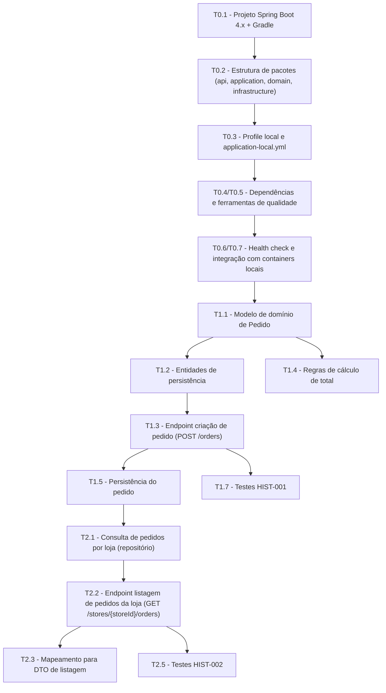

# Fase 1 – MVP Core de Pedidos

Esta fase foca no **core de pedidos** do backend, cobrindo principalmente:

- Criação de pedido por clientes.
- Visualização de pedidos pelas lojas.
- Fluxo básico de status de pedido.

## Arquivos desta fase

- [Feature da Fase 1](./feature.md)
- [HIST-000 – Criação do scaffold do backend](./historia-HIST-000-scaffold-backend.md)
- [HIST-001 – Criação de pedido](./historia-HIST-001-criacao-pedido.md)
- [HIST-002 – Visualização de pedidos pela loja](./historia-HIST-002-visualizacao-pedidos-loja.md)

## Diagrama de Dependências entre Tasks

### Interpretação do Diagrama

- Tasks em **cadeia** (com setas) são dependentes.
  - Ex.: T12 depende de T11; T13 depende de T12; T21 depende de T15.
- Tasks **sem ligação direta** podem ser trabalhadas em paralelo, desde que suas dependências estejam satisfeitas.
  - Ex.: T14 (regras de cálculo) pode evoluir em paralelo a T21, desde que o modelo de domínio (T11) esteja definido.
  - Tests (T17, T25) podem ser iniciados à medida que os respectivos endpoints/regras vão sendo implementados.
